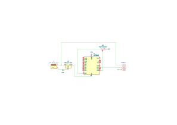

# ESP32C3 Crystal Lamp Controller

I really wanted to print and build [this cool looking crystal style lamp]() as a lamp for my bedside table using some WS2811 LEDs and an ESP32C3 I had laying around.
Since the original lamp uses a pre-built kit, I had to build all of the electronics myself.
Luckily for anyone wanting to build this lamp using these custom electronics, this repo includes the very simple connection diagram and code needed.

I decided to write the code in barebones Rust using `esp-hal`, since this project is really lightweight and this approach produces about 3x smaller code than the Arduino toolchain with the FastLED framework.
It is in all likelihood also a bit faster than equivalent Arduino / FreeRTOS (esp-idf) code.

Later I also want to be able to control the animations and colors of the lamp using a web interface or a mobile app.

## Prerequisites

- [The Rust toolchain](https://rustup.rs/) and
- The `riscv32imc-unknown-none-elf` compile target for compiling
    - To install it, run: `rustup target add riscv32imc-unknown-none-elf`
    - After installing, it should appear in `rustup target list`
- [probe-rs](https://probe.rs/) for flashing and debugging
    - After installation, you should have the `probe-rs`, `cargo flash` and `cargo embed` binaries available

## Schematic

## Building and uploading

Connect your ESP32C3 to your computer and run:

    cargo embed --release

### Debugging
To flash with debugging info, run the above command without the `--release` flag:

    cargo embed
